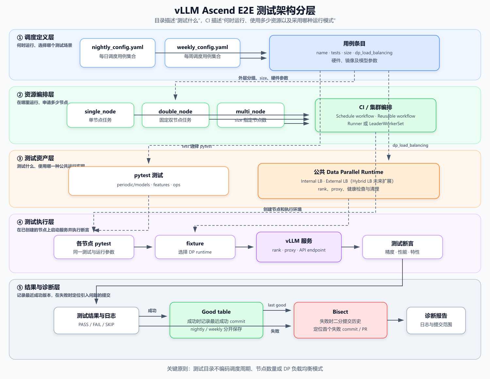
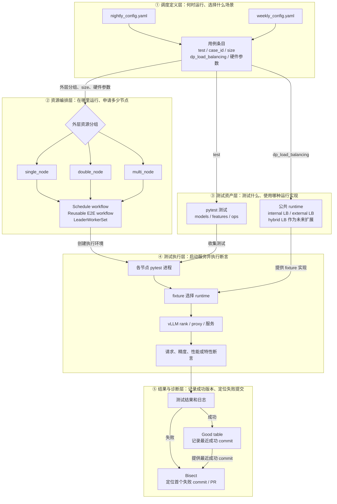

# E2E 测试目录重构分析与建议

## 1. 背景

当前 `tests/e2e/nightly` 和 `tests/e2e/weekly` 下的测试持续增长，测试内容、运行周期和资源拓扑同时体现在目录层级中，导致以下问题：

- 查找用例时需要先知道它属于 nightly 还是 weekly；
- 相同测试能力可能在两个周期目录中重复维护；
- `single_node` 和 `multi_node` 描述的是运行资源，而不是测试内容；
- 测试代码、模型配置、集群启动脚本和结果处理逻辑相互耦合；
- 调整目录会影响 CI、bisect、结果基线及 Python 导入路径。

截至本次盘点，nightly 和 weekly 目录共有 367 个已跟踪文件，其中包括：

- 131 个 `test_*.py` 文件；
- 191 个 YAML 配置文件；
- 17 组文件名相同的 YAML，部分同名文件内容不同；
- `.github`、`tests/e2e`、`tests/ut` 和 `tools` 中约 206 处相关路径或模块引用。

## 2. 重构目标

本次重构只改变测试资产的组织方式，不改变现有调度能力。

需要保留：

1. nightly 和 weekly 两种调度周期；
2. 单节点、2 节点和多节点三类资源调度方式；
3. A2、A3、A5、310P 等硬件及 runner 差异；
4. internal DP、external DP、PD 等部署模式；
5. nightly 和 weekly 各自独立的结果及 bisect 基线。

期望实现：

1. 目录回答“测试什么”；
2. CI 配置回答“何时运行、在哪里运行、需要多少资源”；
3. 测试入口回答“如何启动服务和执行断言”；
4. 不再通过文件路径推断运行周期或资源拓扑。

### 2.1 总体架构分层

目标架构分为调度定义、资源编排、测试资产、测试执行和结果诊断五层：



上图使用静态 PNG 展示，SVG 源文件位于 `docs/source/_static/images/e2e-test-architecture.svg`。下面保留 Mermaid 版本，便于后续调整结构。



各层职责如下：

| 层级 | 负责内容 | 不负责内容 |
| --- | --- | --- |
| 调度定义层 | nightly/weekly、测试选择、场景参数 | 测试实现 |
| 资源编排层 | runner、镜像、节点数、集群创建与回收 | 业务断言 |
| 测试资产层 | models/features/ops 用例及公共 runtime | 定时触发和机器申请 |
| 测试执行层 | 服务启动、请求、断言和清理 | 选择调度周期 |
| 结果与诊断层 | 日志、结果、good table 和 bisect | 测试分类 |

图中有三条关键选择关系：

1. 外层 `single_node/double_node/multi_node` 和 `size` 决定资源；
2. `test` 决定执行 `models/features/ops` 中的哪个 pytest；
3. `dp_load_balancing` 决定 fixture 使用哪一种公共 runtime。

## 3. 建议的目标目录

现有 `pull_request` 目录依赖独立的 PR 调度和路径校验，建议本次保持不变。nightly 和 weekly 的测试资产合并到 `periodic`：

```text
tests/e2e/
├── pull_request/                 # PR 阶段测试，暂不调整
└── periodic/                     # 定期调度的 E2E 测试
    ├── models/                   # 模型精度、性能和模型配置
    │   ├── configs/
    │   └── test_model_benchmark.py
    ├── features/                 # 面向用户或系统能力的测试
    │   ├── pooling/
    │   ├── graph_mode/
    │   ├── speculative_decoding/
    │   ├── structured_output/
    │   └── distributed/          # DP、PD、跨节点通信等特性
    ├── ops/                      # 算子及算子组合测试
    └── common/                   # 通用启动器、集群工具、结果处理和 fixture
        ├── cluster/
        ├── runtime/
        └── reporting/
```

分类以测试的主要目的为准：

- 验证某个模型的精度或吞吐量，归入 `models`；
- 验证池化、图模式、推测解码、DP 或 PD 行为，归入 `features`；
- 验证单个算子或算子组合在 NPU 上的正确性，归入 `ops`；
- 被多个类别复用的启动、资源发现、日志及结果处理代码，归入 `common`。

目录中不再包含 `nightly`、`weekly`、`single_node` 或 `multi_node`。节点拓扑仍然可以出现在测试名称、fixture 参数或 CI 元数据中，但不作为顶层分类。

### 3.1 是否合并 `pull_request` 与 `periodic`

从长期概念看，PR、nightly 和 weekly 都属于调度策略，测试资产可以统一放在 `models/features/ops` 中。但当前 `pull_request` 目录同时承担了 PR 用例白名单和资源路由协议，和 periodic 的执行方式存在较多冲突，本轮不建议直接合并这两个层级。

需要保留的 PR 执行能力包括：

- 基于覆盖率和 AST 的精准测试推荐；
- `/e2e` 指定 pytest 路径以及 ready-all 全量扫描；
- 按 `one_card/two_card/four_card` 选择 runner；
- 根据历史执行时间进行分片；
- 直接执行 pytest，并继续作为 PR required check。

主要阻碍如下：

| 阻碍 | 影响 |
| --- | --- |
| PR 测试范围依赖 `tests/e2e/pull_request` | 直接扫描统一目录会把仅适合 nightly/weekly 的长时间或多机用例带入 PR |
| 卡数和 runner 依赖目录路径 | 移入 `models/features/ops` 后，路径不再表达 1、2、4 卡资源需求 |
| 两套执行模型不同 | PR 以直接 pytest 和选择性执行为主；periodic 还包含数据 YAML、静态矩阵、LWS、多机 runtime、benchmark 后处理和 bisect |
| 调度和结果语义不同 | PR 关注合入门禁和快速反馈，periodic 关注基线、趋势、good table 和 bisect，结果命名空间不能混用 |
| 路径引用范围较大 | 当前约有 137 个 PR pytest 文件，至少 67 个文件直接引用旧路径，还涉及 import、fixture、estimated times、skip 和 curated 清单 |

如果后续决定合并，需要先建立显式的 PR 用例清单或统一 case catalog，用 `case_id` 保存测试路径、SoC、节点数、每节点 NPU 数、预估时间和允许的调度周期。PR 选择器只能在允许 PR 执行的 case 中推荐测试，不能简单把扫描根目录扩大到整个 `tests/e2e`。

会议需要重点讨论：

1. 是否值得为统一物理目录重构现有 PR 选择和路由系统；
2. 资源信息使用统一 case catalog、独立 `pull_request_config.yaml`，还是 pytest marker；
3. 同一 pytest 被 PR、nightly 和 weekly 复用时，如何隔离超时、资源、baseline 和结果；
4. 是否先保持 `pull_request` 与 `periodic` 平级，仅共享 `common` 中的 fixture 和 runtime。

当前建议采用第 4 种方式：保留 `pull_request` 原有入口和执行流程，只合并 nightly/weekly 为 `periodic`。待 periodic 重构稳定后，再单独评估 PR 目录融合。

### 3.2 `models/configs` 的候选划分方式

模型配置数量增长后，`models/configs` 也需要进一步分类。这里存在多个合理维度，最终方案需要结合配置的查找习惯、测试覆盖分析和维护责任人在会议中确认。

#### 方案 A：按照模型家族划分

```text
models/configs/
├── deepseek/
├── qwen/
├── glm/
├── kimi/
├── minimax/
├── gemma/
└── other/
```

模型家族是当前推荐的主目录维度。开发者通常从具体模型开始定位配置，目录归属明确，也能避免量化方式、硬件和调度模式组合产生大量层级。某个家族的配置较多时，可以再按模型系列增加局部子目录，例如 `deepseek/{r1,v3,v4}` 或 `qwen/{qwen3,qwen3_5,qwen3_6}`；配置较少时直接使用文件名区分版本，避免提前建立空目录。

多模态模型可以先放在对应家族中，例如 `qwen/qwen3_vl_32b_w8a8.yaml`。只有同一家族内文本和多模态配置都很多时，再增加 `text/` 和 `vision_language/` 子目录。

#### 方案 B：按照模型结构划分

```text
models/configs/
├── dense/
├── moe/
└── multimodal/
```

也可以进一步表达 encoder-only、decoder-only、encoder-decoder 等结构。该方案适合从模型执行路径、EP 能力或算子覆盖角度检查测试，例如快速查看 MoE 模型是否覆盖不同量化和硬件。

它的不足是结构分类通常不是配置维护者最常使用的入口；同一模型家族可能同时包含 Dense、MoE 和多模态变体，配置会分散到多个目录。`multimodal` 与 `dense/moe` 也不是互斥维度，一个多模态模型仍然可能是 Dense 或 MoE，因此目录规则需要额外约定。

#### 方案 C：按照注意力机制划分

```text
models/configs/
├── mha/
├── mqa/
├── gqa/
├── mla/
└── hybrid_attention/
```

该方案有利于关注 Attention 后端、KV Cache 占用、长序列能力和相关算子的测试覆盖。例如可以直接检查 GQA、MLA 是否都覆盖精度、性能和不同硬件。

它的不足是注意力机制属于横切属性：同一家族不同版本可能使用不同机制，一个模型也可能同时包含多种 Attention 形式或在不同层采用不同结构。模型升级后分类还可能发生变化，因此需要移动文件并同步修改矩阵路径。仅依赖目录也难以表达一个配置覆盖多个注意力机制的情况。

#### 方案 D：按照任务或模态划分

```text
models/configs/
├── text_generation/
├── multimodal/
├── embedding/
├── reranker/
└── classification/
```

该方案适合测试入口、请求协议、数据集和评价指标差异较大的情况。例如生成模型、多模态模型和 embedding 模型通常不会使用完全相同的测试驱动。它对测试框架的边界表达较清楚，但文本生成目录仍会非常大，查找具体模型时还需要第二层模型家族目录。

#### 方案比较

| 主分类维度 | 主要优点 | 主要问题 | 更适合解决的问题 |
| --- | --- | --- | --- |
| 模型家族 | 查找直观，责任归属清楚，目录相对稳定 | 不直接展示结构覆盖情况 | 日常配置维护和模型适配 |
| 模型结构 | 便于检查 Dense、MoE 等执行路径覆盖 | 多个结构属性可能交叉，家族配置会分散 | EP、模型执行路径和算子覆盖 |
| 注意力机制 | 便于检查 MHA、GQA、MLA 等后端覆盖 | 属性可能混合或随版本变化 | Attention 和 KV Cache 专项覆盖 |
| 任务或模态 | 与测试驱动、数据集和指标边界一致 | 生成模型仍需继续细分 | 多类模型任务共存时的框架组织 |

#### 推荐的讨论基线

建议先以模型家族作为物理目录，以结构、注意力机制和模态作为配置元数据：

```text
models/configs/
├── deepseek/
│   ├── r1_0528_w8a8.yaml
│   └── v4_flash_w8a8.yaml
├── qwen/
│   ├── qwen3_32b_w8a8.yaml
│   └── qwen3_vl_32b_w8a8.yaml
└── glm/
```

```yaml
metadata:
  model_family: deepseek
  model_structure: moe
  attention_types:
    - mla
  modality: text
```

CI 或覆盖率检查可以根据这些元数据选择全部 MoE、GQA 或 MLA 配置，不需要为每个维度复制目录。量化方式、SoC、节点数、internal/external LB 和 nightly/weekly 仍分别由配置字段或调度矩阵表达。

会议中可以重点确认两点：

1. 团队最常见的入口是“查找某个模型配置”，还是“检查某种结构或 Attention 的覆盖”；
2. 是否需要建立可由 CI 查询的模型元数据 schema。如果不建立元数据，采用模型家族目录后，结构和 Attention 覆盖仍需要依赖文件名或人工统计。

另外，主要验证 MTP、Prefix Cache、图模式或 Memcache 等功能的配置应归入相应 `features` 目录。是否留在 `models`，以测试失败时主要说明“模型基线退化”还是“特性行为异常”为判断标准。

## 4. 调度与目录的边界

### 4.1 调度周期

继续保留：

- `.github/workflows/configs/nightly_config.yaml`；
- `.github/workflows/configs/weekly_config.yaml`；
- nightly 和 weekly 各自的定时触发及手动命令；
- 各自独立的 good table 和结果命名空间。

两个矩阵可以引用同一个测试文件。测试属于哪个周期，由矩阵是否选中它决定，而不是由它所在的目录决定。

### 4.2 资源拓扑

继续保留以下运行模式：

| 运行模式 | 含义 | 调度侧职责 |
| --- | --- | --- |
| `single_node` | 单节点运行 | 选择 runner、镜像和单机测试入口 |
| `double_node` | 固定 2 节点运行 | 申请两节点资源并传递节点信息 |
| `multi_node` | 节点数由用例指定 | 根据 `size` 创建集群并协调各节点 |

这些字段可以继续作为 CI 矩阵的分组，以便复用现有工作流。取消目录层级不等于取消这些调度概念。

### 4.3 DP 负载均衡模式

现有 `internal_dp` 和 `external_dp` 目录实际上区分的是 DP rank 的启动及请求负载均衡方式。建议在调度配置中使用 `dp_load_balancing` 字段。当前仓库先支持 `internal` 和 `external`；上游的 `hybrid` 模式可以作为未来扩展：

```yaml
a3:
  multi_node:
    test_config:
      - name: speculative-decoding-external-lb
        case_id: feature.speculative_decoding.accuracy.external_lb
        test: tests/e2e/periodic/features/speculative_decoding/test_accuracy.py
        size: 4
        dp_load_balancing: external
```

各字段分别表达：

- 外层 `single_node`、`double_node` 或 `multi_node`：选择资源调度方式；
- `size`：为 `multi_node` 指定具体节点数；`double_node` 固定为 2，通常不需要重复填写；
- `dp_load_balancing`：当前选择 internal 或 external DP 负载均衡；
- `test`：最终执行的 pytest 文件或 node id。
- `case_id`：结果记录和 bisect 使用的稳定用例标识。

`npu_per_node` 不建议作为每个用例条目的必填字段。它描述的是每个节点可分配的 NPU 容量，调度器在创建 Pod 或 LWS 时必须知道，但当前工作流已经根据 SoC/runner 类型得到该值（例如部分 A2 环境为 8，A3 环境为 16）。如果再由用例条目保存一份，调度值和测试值可能不一致。

建议继续由现有 CI 硬件资源配置根据 SoC/runner 类型确定节点容量，不在用例条目中增加新的 NPU 资源字段。TP、DP、PP 等服务实际使用的设备数量继续由测试配置表达。

当前嵌套矩阵中不应在条目内重复增加 `resource_mode`，否则外层分组和条目字段可能发生冲突。未来如果改成扁平矩阵，可以用 `resource_mode` 替代外层分组，但两种表达方式不应同时存在。

nightly 和 weekly 已经由矩阵文件本身表达，不需要在每个条目中重复保存调度周期。

同一个 pytest 可以由多个矩阵条目在不同模式下运行：

```yaml
a3:
  multi_node:
    test_config:
      - name: speculative-decoding-internal-lb
        test: tests/e2e/periodic/features/speculative_decoding/test_accuracy.py
        size: 4
        dp_load_balancing: internal

      - name: speculative-decoding-external-lb
        test: tests/e2e/periodic/features/speculative_decoding/test_accuracy.py
        size: 4
        dp_load_balancing: external
```

不建议在每个特性目录下重复建立 `internal_dp/` 和 `external_dp/`。例如 `speculative_decoding` 和 `structured_output` 的测试步骤与断言仍放在各自的特性目录中，不同负载均衡模式的公共启动实现集中放置：

```text
tests/e2e/periodic/
├── features/
│   ├── speculative_decoding/
│   └── structured_output/
└── common/
    └── data_parallel/
        ├── internal_lb.py
        └── external_lb.py
```

如果后续真正增加 `--data-parallel-hybrid-lb` 用例，再新增 `hybrid_lb.py` 和相应矩阵取值。

如果同一特性在两种模式下使用相同断言，由 fixture 根据 `dp_load_balancing` 选择 runtime。如果测试逻辑确实不同，可以在同一个特性目录下使用 `test_internal_load_balancing.py` 和 `test_external_load_balancing.py`。只有某种模式已经形成大量专属测试时，才在该特性内部增加局部子目录。

### 4.4 `dp_load_balancing` 如何传给测试

本节不增加新的调度类型，只说明矩阵中的 `dp_load_balancing` 如何到达测试进程。

假设 weekly 矩阵中有以下任务：

```yaml
a3:
  double_node:
    test_config:
      - name: structured-output-external-lb
        test: tests/e2e/periodic/features/structured_output/test_openai_api.py
        size: 2
        dp_load_balancing: external
```

执行过程为：

1. 外层 `double_node` 让 schedule workflow 选择双节点任务；
2. `size: 2` 让集群 workflow 创建两个节点；
3. schedule workflow 把 `dp_load_balancing: external` 传给多机 workflow；
4. 多机 workflow 在两个节点中设置 `DP_LOAD_BALANCING=external`；
5. 每个节点的 `run.sh` 使用相同参数启动 pytest；
6. pytest fixture 读取该参数并使用 `ExternalLBServer`；
7. 如果值是 `internal`，同一个测试改用 `InternalLBServer`。

对应的命令可以简化为：

```bash
pytest -sv \
  tests/e2e/periodic/features/structured_output/test_openai_api.py \
  --dp-load-balancing external
```

这样，测试文件只负责发送请求和检查 structured output。DP rank 进程、代理、健康检查和资源清理由 `ExternalLBServer` 负责。

选择模式的唯一权威来源是 nightly/weekly 矩阵。pytest marker 可以用于标注测试能力，但不能决定申请几个节点或采用哪种 DP 模式，因为 pytest 启动时集群已经创建完成。

迁移初期继续保留现有 `single_node`、`double_node`、`multi_node` 外层结构，只增加并透传 `dp_load_balancing`。

## 5. 当前主要阻碍

### 5.1 运行周期依赖目录名

结果后处理当前通过 `CONFIG_BASE_PATH` 是否包含 `weekly` 推断结果属于 nightly 还是 weekly。合并为 `periodic` 后，这种推断将失效。

处理方式：复用 workflow 已有的 `test_frequency=nightly|weekly` input，将其显式传给结果处理；结果处理只读取该字段，不再从目录名推断周期。

### 5.2 多机入口依赖配置路径

多机 `run.sh` 当前通过配置路径是否包含 `external_dp/config` 来选择 internal DP 或 external DP 入口。

处理方式：在矩阵中显式传入 `dp_load_balancing`，并由统一 pytest fixture 选择对应 runtime。路径只用于定位文件，不再决定运行行为。

### 5.3 同名 YAML 冲突

nightly 和 weekly 中存在 17 组同名 YAML，且部分同名文件内容不同。不能直接复制到同一个 `configs` 目录。

每组需要判断：

1. 内容相同：合并为一个配置，由两个周期共同引用；
2. 仅 benchmark 参数不同：提取公共配置，周期差异放到 CI 参数或配置变体中；
3. 语义确实不同：用模型、量化、硬件或场景信息明确命名。

不建议继续用 `_nightly`、`_weekly` 作为文件名差异，因为这会重新把调度周期写入测试资产。

### 5.4 固定路径引用较多

受影响范围包括：

- nightly 和 weekly 测试矩阵；
- 单节点及多节点可复用 workflow；
- `run.sh` 和 LeaderWorkerSet 模板；
- `tests/e2e/conftest.py` 及测试内部 Python 导入；
- `tools/bisect`；
- good table 更新脚本；
- 单元测试、开发文档和命令示例。

路径迁移必须使用全仓检索，并对每批改动做引用完整性检查。

### 5.5 历史基线包含测试路径

good table 和 bisect 使用 `soc + scene + test_path` 识别用例。路径改变后，新记录可能无法匹配旧记录。

短期可以在迁移时提供旧路径到新路径的映射。长期建议引入不依赖路径的稳定 `case_id`，例如：

```text
model.qwen3_235b.w8a8.performance
feature.external_lb.kv_transfer
op.triton.rms_norm
```

### 5.6 fixture 作用域可能变化

当前算子目录中的 `conftest.py` 会初始化 NPU/Triton 环境。移动目录时必须保持它只作用于 `ops`，避免影响模型或特性测试。

## 6. 建议的实施顺序

### Workflow 改造原则

不建议为新目录复制一套 `schedule_periodic_test_<soc>.yaml`。现有 `schedule_nightly_test_a2/a3/a5/310p.yaml` 和 weekly workflow 继续作为稳定的顶层编排入口，保留触发参数、job 名称、并发控制、镜像构建、资源队列、日志上传、good table 和 bisect 行为。

迁移采用向后兼容方式修改现有复用 workflow：先增加可选输入和旧逻辑 fallback，在矩阵内容不变的情况下验证执行结果不变，再逐条把配置路径切换到 `periodic`。迁移期间不同时运行两套定时 workflow，避免重复占用 NPU、重复上传结果和更新 good table。

以 `.github/workflows/schedule_nightly_test_a3.yaml` 为例：

| 文件或组件 | 处理方式 |
| --- | --- |
| `schedule_nightly_test_a3.yaml` | 保留文件、触发方式及现有四组 job，只增加向复用 workflow 透传可选字段 |
| `resolve_nightly_tests.py` | 同时接受旧路径和新路径，矩阵输出结构保持兼容 |
| `_e2e_nightly_single_node.yaml` | 继续支持当前默认路径；当矩阵提供 `config_base_path` 时使用新路径 |
| `_e2e_nightly_multi_node.yaml` | `dp_load_balancing` 缺省时继续按旧路径判断，显式提供时使用字段值 |
| `nightly_config.yaml` | 用例分批修改路径，不一次性切换全部条目 |
| 旧 Python/Shell 入口 | 灰度期间保留为兼容 wrapper，内部调用迁移后的 `periodic/common` 实现 |

A3 顶层 workflow 的主要逻辑保持不变：`setup-vars` 继续读取 `a3.multi_node`、`a3.double_node`、`a3.single_node` 和 `a3.multi_card`，四组 job 继续分别调用现有 single-node 或 multi-node 复用 workflow。需要增加的只是兼容透传，例如 single-node 将矩阵中的可选 `config_base_path` 传下去，multi-node 将可选 `dp_load_balancing` 传下去；旧矩阵没有这些值时执行路径与当前一致。

建议拆成以下独立变更：

1. 先提交兼容参数、fallback 和矩阵静态校验，不移动任何测试文件；
2. 将公共实现迁入 `periodic/common`，旧入口暂时保留 wrapper；
3. 选择少量 single-node、internal DP 和 external DP 用例做手动验证；
4. 按类别分批更新 nightly/weekly 矩阵路径，每批验证后再继续；
5. 完成所有切换并观察至少一个 nightly 和一个 weekly 周期后，再删除旧入口和 fallback。

这样每个迁移批次都可以只回退对应矩阵路径，现有 schedule workflow、触发命令和结果处理入口不需要切换回另一套实现。

### 阶段一：解除路径与语义的耦合

1. 让结果处理显式读取 workflow 已有的 `test_frequency`；
2. 让多机启动显式读取 `dp_load_balancing` 并选择对应 runtime；
3. 为调度条目补充稳定的资源信息；
4. 为 good table 设计路径迁移方案或稳定 `case_id`。

该阶段先不移动测试文件，以便单独验证行为变化。

### 阶段二：建立 `periodic/common`

1. 移动通用结果处理代码；
2. 移动单机和多机公共 runtime；
3. 修正 Python 导入和 bisect 入口；
4. 为路径解析、周期标识和运行入口选择增加单元测试。

### 阶段三：迁移 `ops` 和 `features`

1. 先迁移依赖少、没有配置冲突的算子测试；
2. 保持算子专用 `conftest.py` 的作用域；
3. 将结构化输出、池化、图模式和推测解码等迁入 `features`。

### 阶段四：迁移模型测试与配置

1. 逐组处理 17 个同名 YAML；
2. 会议确认 `models/configs` 的主分类维度和模型元数据 schema；
3. 按选定规则迁移模型家族或其他分类目录；
4. 合并公共模型配置；
5. 保留确有必要的参数变体；
6. 同步更新 nightly 和 weekly 矩阵引用。

### 阶段五：清理旧目录

1. 确认全仓不再引用旧路径；
2. 删除空的 `nightly` 和 `weekly` 测试目录；
3. 更新贡献指南和命令示例；
4. 验证定时任务、手动命令、结果上传和 bisect。

## 7. 验收标准

目录迁移完成后应满足：

- nightly 和 weekly 的用例集合与迁移前一致；
- 单节点、2 节点和多节点任务使用的资源数量与迁移前一致；
- internal DP、external DP 和 PD 使用正确的测试入口；
- pytest 能收集所有直接测试文件；
- 所有矩阵中的测试路径和配置路径都存在；
- nightly 和 weekly 的结果写入各自的结果空间；
- good table 和 bisect 可以识别迁移后的用例；
- 算子 fixture 不影响 `models` 和 `features`；
- 全仓不再依赖 `tests/e2e/nightly` 或 `tests/e2e/weekly` 的旧路径。

## 8. 结论

建议采用 `tests/e2e/periodic/{models,features,ops,common}` 作为目标结构，并暂时保持 `tests/e2e/pull_request` 不变。

nightly/weekly 和 single-node/double-node/multi-node 应继续存在于调度配置及运行元数据中。目录重构的核心是将“测试内容”与“运行方式”分离，而不是减少现有调度能力。整个迁移应先解除路径耦合，再分批移动文件，以降低 CI 和历史基线同时失效的风险。

## 9. 工作量评估

### 9.1 估算前提

以下估算基于这些范围约束：

- 保留 nightly 和 weekly 两套调度周期；
- 保留单节点、2 节点和多节点调度方式；
- 保留现有硬件、镜像和部署模式；
- `pull_request` 目录暂不迁移；
- 模型精度和性能测试继续采用数据驱动方式；
- 不在本次重写整套 GitHub Actions 调度框架。

估算单位为一名熟悉 Python、pytest 和现有 CI 的工程师所需的人日。多机 NPU 任务的排队时间单独计算。

### 9.2 估算依据

当前直接相关的代码规模为：

| 项目 | 数量 |
| --- | ---: |
| nightly/weekly 已跟踪文件 | 367 |
| Python 文件 | 164 |
| pytest 测试文件 | 131 |
| YAML 配置文件 | 191 |
| Shell 脚本 | 7 |
| 同名 YAML 冲突组 | 17 |
| 包含旧路径或旧模块引用的文件 | 约 70 |
| 其中 workflow 文件 | 8 |
| 直接使用旧 Python 包路径的文件 | 37 |

大量文件移动本身是机械工作。主要成本来自配置冲突判断、路径语义解耦、历史基线兼容和真实 NPU 环境验证。

### 9.3 推荐方案工作分解

| 工作项 | 主要内容 | 估算 |
| --- | --- | ---: |
| 方案和迁移清单 | 确认分类规则、生成旧路径到新路径映射、确认 CI owner | 1～2 人日 |
| 解除周期路径耦合 | 复用并透传已有 `test_frequency`，修改结果处理及相关测试 | 1～2 人日 |
| 解除 DP 路径耦合 | 显式传递 `dp_load_balancing` 并选择对应 runtime | 1～2 人日 |
| 公共运行代码迁移 | 整理 `common`，更新 Python 导入、Shell 入口和 fixture | 2～3 人日 |
| `ops` 和 `features` 迁移 | 移动测试、维持 `conftest.py` 作用域、更新矩阵 | 2～4 人日 |
| 模型配置迁移 | 迁移 191 个 YAML，检查并处理 17 组同名冲突 | 3～5 人日 |
| CI 矩阵与工作流调整 | 更新 nightly/weekly、单节点/2 节点/多节点的所有引用 | 2～3 人日 |
| good table 与 bisect | 路径兼容、场景标识、历史记录迁移或稳定 `case_id` | 2～3 人日 |
| 文档与静态检查 | 更新贡献文档、命令示例，执行格式和引用完整性检查 | 1～2 人日 |
| NPU CI 验证与修复 | 覆盖各周期、拓扑、硬件和部署模式的代表用例 | 3～5 人日 |

推荐方案合计约 **18～31 人日**。如果历史 good table 可以直接重新生成，且同名 YAML 很快完成确认，通常可以控制在 **18～24 人日**；如果需要完整兼容历史路径和多个 release 分支，接近区间上限。

### 9.4 不同实施范围的对比

| 实施范围 | 内容 | 工程投入 | 预计自然周期 |
| --- | --- | ---: | ---: |
| 最小迁移 | 移动目录、批量改路径，暂时保留路径推断及兼容代码 | 8～12 人日 | 2～3 周 |
| 推荐迁移 | 解除路径语义耦合、处理配置冲突、兼容 bisect 和基线 | 18～24 人日 | 3～5 周 |
| 深度重构 | 推荐迁移，加上公共 runtime 重构和 CI schema 统一 | 25～40 人日 | 5～8 周 |

自然周期包含代码评审、NPU 资源排队和定时任务观察时间。两个工程师可以并行处理测试资产与 CI/runtime，但多机验证和最终切换存在先后依赖，整体周期通常不能按人数等比例缩短。

### 9.5 建议的人员安排

两人协作较合适：

- 工程师 A 负责公共 runtime、结果处理、good table、bisect 和多机入口；
- 工程师 B 负责目录迁移、YAML 冲突处理、矩阵更新和文档；
- 两人共同完成 NPU CI 验证和最终旧目录清理。

按推荐范围，两人预计需要 **2～3 周开发时间，加 1～2 周灰度观察**。如果只有一人，建议按 `ops`、`features`、`models` 分三个 PR 逐步迁移，避免形成难以审查的大型改动。

### 9.6 建议预留的风险缓冲

建议在工程投入之外预留约 20% 缓冲，主要用于：

- 多机任务排队或偶发基础设施失败；
- 同名 YAML 实际语义无法仅通过文本比较确认；
- release 分支、手动 slash command 或外部脚本仍依赖旧路径；
- good table 中历史数据需要兼容；
- 文件移动导致 pytest fixture 作用域或测试收集行为变化。
